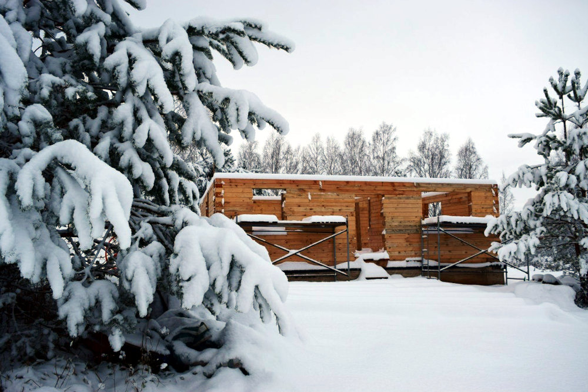

title: Саша и Света Гусевы
labels: residents
thumbnail: together2.jpg
wideimage: bridge.jpg
widetext: Зимуют в поселении с 2014 года.  Увлекаются автомобилями.  Работают в поселении, строят дом из профилированного бруса.  В планах баня и авторемонтная мастерская.
hidden: yes
keywords: переезд на землю, переезд, дауншифтинг
summary: Саша и Света зимуют в поселении с 2014 года.  Увлекаются автомобилями.  Работают в поселении, строят дом из профилированного бруса.  В планах баня и авторемонтная мастерская.
comments: yes
---
Саша почти всю жизнь прожил в Твери.
Работал на заводе токарем, оператором лазерного станка, ювелиром, увлекался автомобилями.
С детства жил в частном секторе и жизнь свою видел только за городом, а не в панельных многоэтажках.
Не понаслышке знаком с приусадебным хозяйством, но когда услышал от родственников об идее жизни в глуши -- отнёсся к ней скептически.
В 2011 году родители пригласили его помочь построить временный дом в нашем поселении.
Пробыв какое-то время в только появлявшемся на тот момент Чистом небе (зимовало всего две семьи), его отношение к жизни вдали от городов начало меняться.

Света с детства жила в Санкт-Петербурге, работала менеджером по продажам в фитнесс-центре, продавцом в магазине кедровой продукции.
С раннего возраста мечтала жить на природе, подальше от больших городов.
Однажды она познакомилась с [книгами об Анастасии][1] и поняла, что эти идеи ей близки.
С помощью приятеля, который разделял её интересы, начала искать подходящее для жизни поселение.
В 2010 году они приехали в Пушкинские Горы -- но там им не понравилось, и они поехали в Чистое небо.
Здесь Света поняла, что хочет остаться, и сразу выбрала участок.
Годом позже их с Сашей пути пересеклись, с тех пор они живут и строят своё будущее вместе.

{{ album4("""
sasha-dima.jpg
car.jpg
phone.jpg
zags.jpg
""") }}

В 2012 году, уже определившись с местом для будущей жизни, Саша и Света приехали в поселение на всё лето.
Жили в палатке, под большим уличным тентом (3×9 м).
К концу лета с помощью соседей поставили сруб бани размером 3×4 м (изготовили в Опочке, с доставкой обошёлся в 34,500 рублей).
Однако стройку заморозили, сосредоточившись на основном доме, чтобы скорее переехать.
Лишь через год, приехав в поселение на несколько летних недель, накрыли баню крышей.
В таком виде она и стоит сегодня, ждёт своего часа.

В 2014 году решили впервые зимовать в поселении.
Поменяли свою Toyota Soarer на внедорожник RAV4, закончили все свои дела в городе, собрали вещи и приехали.
Живут в построенном вместе с родственниками общем доме, строят свой собственный дом из профилированного бруса.
В наших краях такие дома не делают, поэтому весь комплект пришлось везти из Твери (дом размером 9×9 м с доставкой обошёлся в 193,000 рублей).
К середине лета был готов фундамент, а к зиме возвели стены.
Почти всё делали вдвоём, иногда помогали родственники и соседи.

{{ album4("""
banya1.jpg
cedar.jpg
house.jpg
together.jpg
""") }}

Саша и Света быстро выяснили, что у них есть общее увлечение автомобилями.
Это их основное хобби, есть большой опыт разных автослесарных работ для своих нужд.
Своё будущее они видят в этом: в поселении почти у всех есть автомобили, и местная автомастерская будет востребована.
Но до её появления ещё далеко.

Сейчас Саша работает разнорабочим в поселении, 4-5 дней в неделю, 3-8 часов в день, занимается в основном стройкой и отделкой.
Заработанных денег хватает на еду и все текущие расходы, удаётся кое-что вкладывать в обустройство общего дома (который изначально не был задуман для зимовки).
Уже есть заказы на несколько новых домов -- это позволит к концу сезона достроить собственный, и новый год встретить уже действительно на своей земле, в своём доме.
Потом нужно будет оборудовать баню и построить мастерскую -- работы ещё много.
Света занимается хозяйством, во всём помогает мужу, печёт хлеб на заказ.

В будущем планируют родить детей, завести собаку и кур.
Животноводством заниматься не хотят, зато огород будет большой, чтобы обеспечить себя собственными овощами.
Саша будет в свободное время заниматься автомобилями, а Света -- саморазвитием.

Участок Саши и Светы находится на территории бывшей деревни Большое Дроздово.
К нему примыкает участок [Димы](/residents/dima/) (родной брат Саши) и [Ани](/residents/anna/), Сергея и Ларисы (родители), Александра (отец Димы).
Это четыре родственные семьи, формирующие одно большое семейство.
Это первое действительно родовое поместье в поселении Чистое небо.

[1]: https://ru.wikipedia.org/wiki/%D0%97%D0%B2%D0%B5%D0%BD%D1%8F%D1%89%D0%B8%D0%B5_%D0%BA%D0%B5%D0%B4%D1%80%D1%8B_%D0%A0%D0%BE%D1%81%D1%81%D0%B8%D0%B8_(%D1%81%D0%B5%D1%80%D0%B8%D1%8F_%D0%BA%D0%BD%D0%B8%D0%B3)
