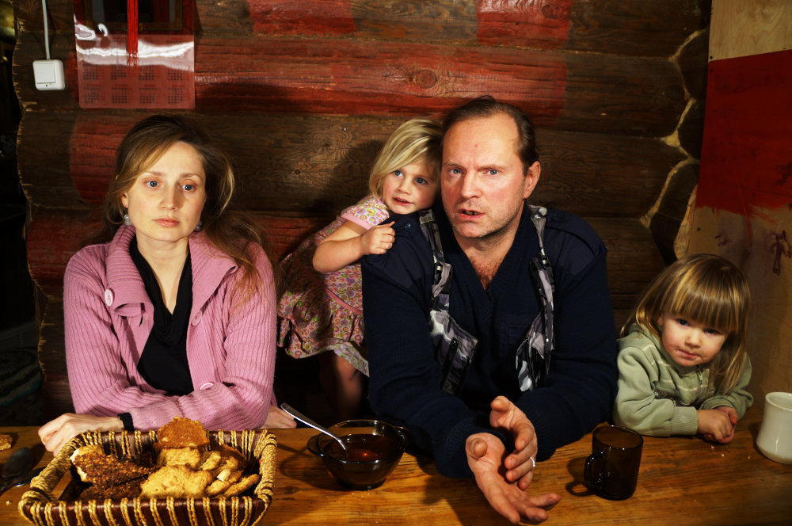
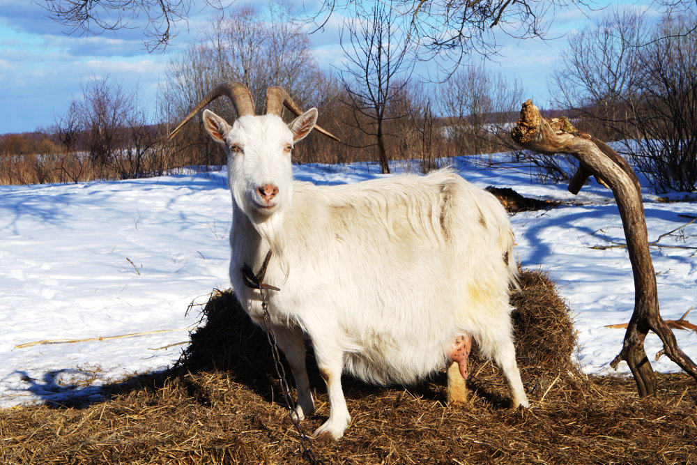

title: Алексей и Галина Богдановы-Лебедевы
labels: residents
list_title: Алексей и Галина
list_text: Первая зимующая и единственная многодетная семья.
widetext: Первые жители поселения, зимуют с 2006 года.  Обжились, родили в поместье троих детей, занимаются подсобным хозяйством.
summary: Первые жители поселения, зимуют с 2006 года.  Обжились, родили в поместье троих детей, занимаются подсобным хозяйством.
keywords: переезд на землю, переезд, дауншифтинг
---
Алексей родом из Санкт-Петербурга, где и прожил большую часть жизни.  В городе занимался разными делами, от ночных клубов до общепита.  Есть два высших образования: педагогическое и филологическое.  Профессионально занимается массажем, умеет фехтовать, стреляет из арбалета и вообще всесторонне развит.

С детства его тянуло на природу, по возвращении из армии эта мысль сформировалась окончательно.  В 2006 году, объездив соседние области, добрался до Псковской, там -- до Себежского района, где воля случая привела его в деревню Дашково.  Попав сюда, он в тот же день выкупил участок на берегу озера со старым полуразрушенным местным домом, установил рядом палатку и остался жить.  С этого началось поселение Чистое небо.

Галина присоединилась к нему позже -- в 2010 году.  У неё уже было двое детей, вместе родили ещё двоих -- все дети домашние; Арсений живёт в городе с отцом, приезжает на лето, а Настя, Раданая и Родан живут в поселении круглый год.  Галя занимается домашним хозяйством, огородом, воспитанием детей.  Регулярно проводит у себя девишники и детишники, танцы.

{{ album4("""
rada.jpg;;Раданая
rodan.jpg;;Родан
nastya.jpg;;Настя
pics.jpg;;Детское творчество
""") }}

Алексей осваивал сельскую жизнь практически с нуля.  Некоторое время работал на лесопилке в соседней деревне, но большую часть времени постоянного заработка нет.  Однако это не мешает содержать и развивать хозяйство.  Построен просторный рубленый дом, баня, старый деревенский дом разобран -- на его месте теперь мастерская.

{{ album4("""
new_house.jpg;;Дом хозяев;Новый просторный двухэтажный рубленный дом.
banya.jpg;;Баня;Рядом с баней выкопан пруд.  В баню регулярно приглашают соседей и гостей.
old_house.jpg;;Старый дом;В 2015 году его разобрали, теперь на этом месте мастерская.
""") }}

Первые годы с Алексеем жила коза Буджа, но её пришлось отдать: ела все ценные саженцы.  Сейчас из домашних животных есть кошки, собаки и декоративная свинка.  Есть несколько колод, которые каждый год дают немного мёда.

В любое время [принимают гостей](/stay/alexey/).

