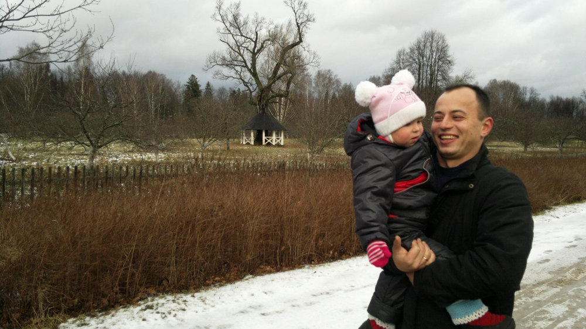
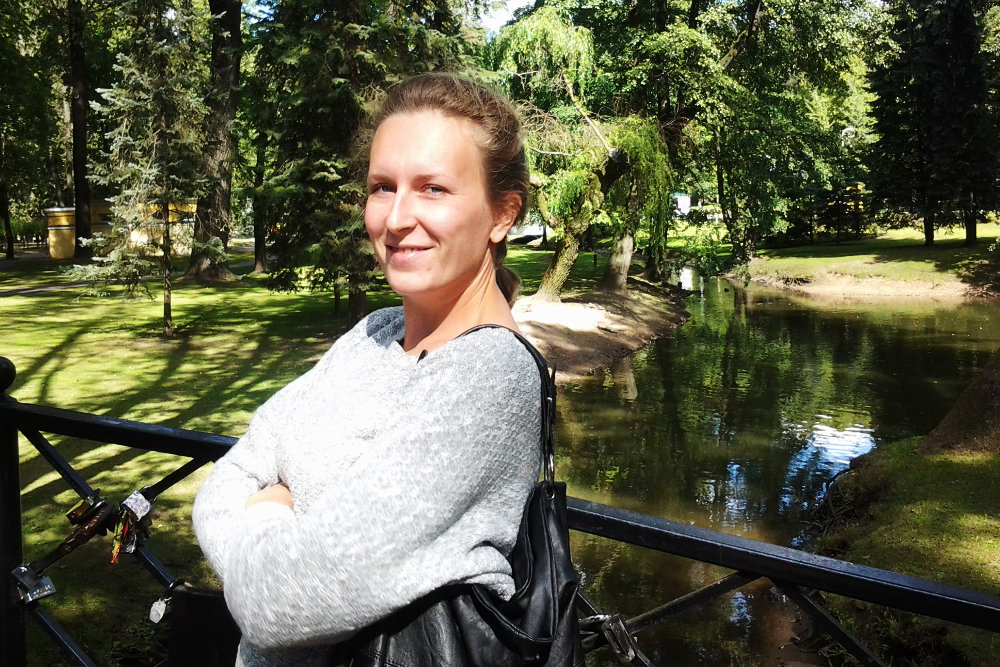
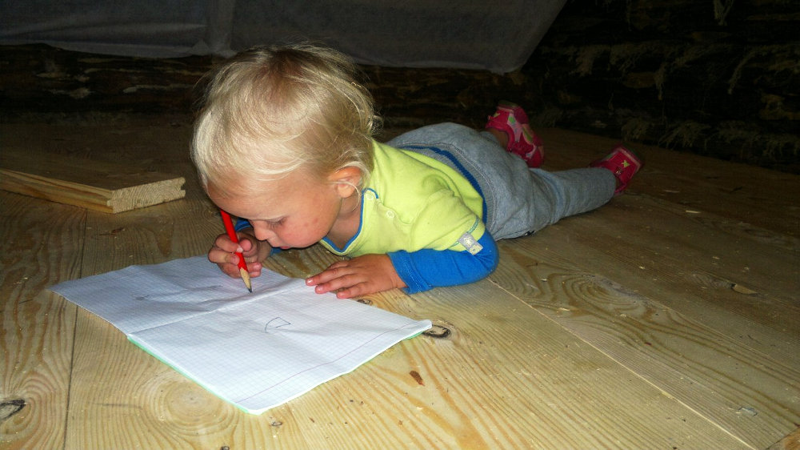
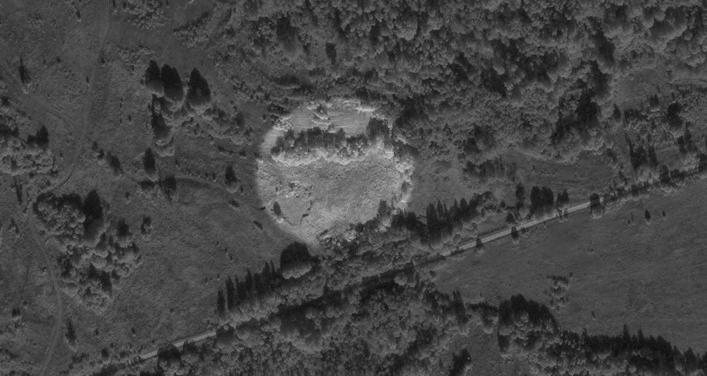
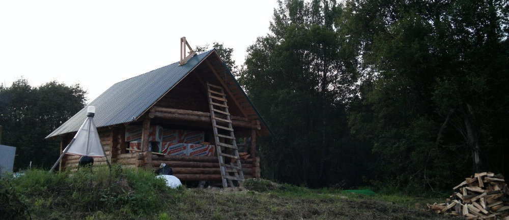
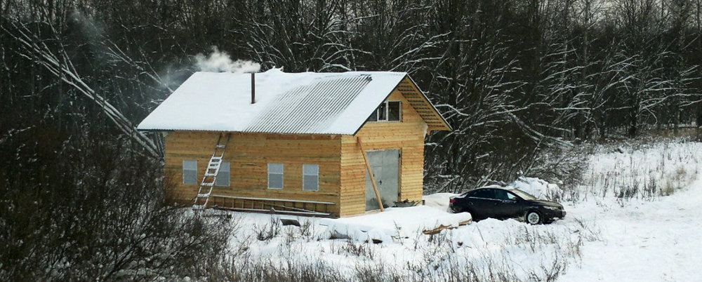
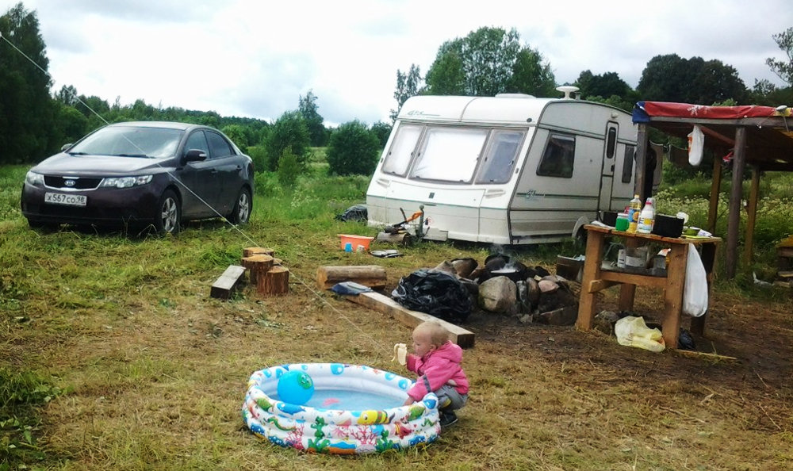

title: Лёша и Настя Плявины
labels: residents
thumbnail: couple.jpg
widetext: Приехали из Питера, зимуют с 2014 года.  Родили дома обоих детей -- дочь Миру и сына Захара.  Давно мечтали о своём доме на природе и эта мечта сбылась.
wideimage: wide.jpg
image: wide.jpg
---
Лёша родился в [посёлке Борок][3] Ярославской области.  Детство и юношество провёл там, занимался охотой и рыбалкой, учился в Ярославле, после жил в Москве, в Карелии, в Питере -- но тяга к загородной жизни в нём осталась.  Во время учёбы ему случайно попались в интернете [книги Мегре][2], которые помогли определиться с мировоззрением.

В городе последние годы работал в сфере информационных технологий -- занимался созданием сайтов и рекламой.  В будущем планировал ехать в Европу на заработки, 6 месяцев провёл в США.  Познакомившись с трудами Мегре, открыл свой первый местный бизнес: представительство [Клуба органического земледелия][1].  Так начался его путь к жизни на своей земле.

Настя родилась в Перми.  По образованию лингвист-переводчик, владеет немецким и английским языками.  Жила в разных городах, в последнее время -- в Питере, работала диспетчером в аэропорту Пулково.  У неё с детства была мечта жить в своём загородном доме, но не было ясно как её реализовать.  Мечта так и осталась бы мечтой, но знакомство с Лёшей всё изменило.

Поселение начали искать ближе к Питеру, ездили по соседним областям.  Потом решили поехать на юг и приехали в Чистое небо.  Здесь сразу понравилась общая атмосфера, открытость встретивших людей (первых поселенцев), отсутствие устава.  Это была середина апреля 2012 года.  Через неделю они вернулись, выбрали и начали оформлять участок площадью чуть менее гектара, с некогда большим прудом, сейчас требующем расчистки и углубления.  Летом построили небольшой навес для хранения инвентаря, жили в палатке, а 4 сентября дома в Питере родилась дочь Мирослава.

Весной следующего года на ближайшей лесопилке заказали сруб бани.  Изготовили его с задержкой, собрали только в октябре -- в том сезоне уже не было шансов его заселить.  Первую зимовку пришлось отложить на один год.

Весной 2014 года приехали в поселение с мобильным домом, в котором есть душ, туалет, кухня -- он вполне пригоден для проживания при плюсовой температуре снаружи.  (В будущем этот дом будут использовать как гостевой или для путешествий.)  Позже сруб накрыли крышей, врезали окна, двери, законопатили, провели электричество от ближайших соседей, выкопали рядом колодец и остались зимовать.

2015 год был первым годом полноценной жизни на своей земле.  Засадили небольшой огород -- собрали приличный урожай основных культур: огурцы, помидоры, перцы, много зелени.  Кое-что заготовили на зиму, но большую часть съели в свежем виде, просто потому, что заготовки пока негде хранить.  Заготовили немного трав.

Лёша в этом году построил себе мастерскую.  Это большое просторное помещение площадью 6×8 метров, утеплённый минеральной ватой деревянный каркас.  Планов мастерить в ней что-то серьёзное нет, но нужно отдельное помещение, где можно уединиться и концентрироваться на пока ещё удалённой работе.  В бане с малым ребёнком это делать сложно, поэтому в начале года приходилось снимать офис в Себеже, летом -- работать в доме на колёсах.  Теперь есть своё полноценное круглогодичное отапливаемое рабочее место.  В этом же помещении могут проходить собрания, детишники и девичники.

Осенью 2015 года родился сын Захар.  Родился дома в Питере, как и сестра Мира.

Планы на ближайший год -- построить погреб, съездить на экскурсию к Зеппу Хольцеру, перевезти живущих на севеве родителей поближе к себе (вероятно в Себеж).  Дом строить пока не планируют -- не ясно каким он должен быть; знают только, что это должен быть небольшой, но сказочный домик необычного вида.  Будет организован небольшой питомник для содержания купленных саженцев, пока нет чёткого плана участка.

Лёша и Настя всеядны.  В своём пруду они планируют разводить местные виды рыбы, будет небольшая пасека для собственных нужд (прежде всего для опыления), будет огород.  Есть желание обеспечивать свои потребности по большей части своими силами, но заниматься сельским хозяйством в промышленных масштабах желания нет -- скорее это будет личное подсобное хозяйство.  Лёша хотел бы перестать заниматься сайтами, но удалённая работа, вероятно, останется, как довольно эффективный способ заработка.

Переезд в целом дался легко, без осложнений.  Насте поначалу было непривычно отсутствие бытового комфорта, и немного страшно было жить в лесу, особенно когда у местных енотов начинается гон и они «орут под окнами как резаные собаки».  Но это быстро прошло, и теперь они очень довольны сделанным выбором.  Жить на земле хорошо, в городе -- плохо.  В поселении нашли то, что искали: дом, родовую землю.  Надеятся, что дети если и не поселятся здесь, то будут часто приезжать.

- [Лёша в контакте](https://vk.com/tel9294086)
- [Настя в контакте](https://vk.com/id517388)

[1]: http://cluboz.ru/
[2]: https://ru.wikipedia.org/wiki/%D0%97%D0%B2%D0%B5%D0%BD%D1%8F%D1%89%D0%B8%D0%B5_%D0%BA%D0%B5%D0%B4%D1%80%D1%8B_%D0%A0%D0%BE%D1%81%D1%81%D0%B8%D0%B8_(%D1%81%D0%B5%D1%80%D0%B8%D1%8F_%D0%BA%D0%BD%D0%B8%D0%B3)
[3]: https://ru.wikipedia.org/wiki/%D0%91%D0%BE%D1%80%D0%BE%D0%BA_(%D0%9D%D0%B5%D0%BA%D0%BE%D1%83%D0%B7%D1%81%D0%BA%D0%B8%D0%B9_%D1%80%D0%B0%D0%B9%D0%BE%D0%BD)
